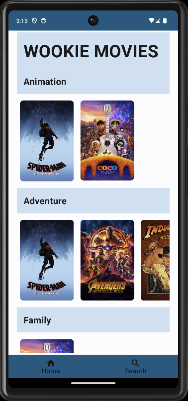
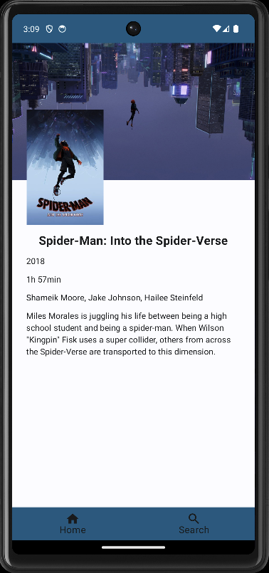

# Wookie-Movies

Wookie-Movies is an Android application built with Jetpack Compose that allows users to browse and discover movies.
It fetches movie data from an external API and presents it in a user-friendly interface.

## Features

- Browse a list of popular movies. Sort them by type
- Search for movies by title.
- View movie details, including poster, synopsis, and ratings.

## Screenshots

## Technologies Used

- Jetpack Compose: For building the UI.
- Kotlin: The primary programming language.
- Retrofit: For making API calls.
- Coroutines: For handling asynchronous operations.
- Dagger hilt: For dependency injection.

## Getting Started

1. Clone the repository: `git clone https://github.com/plbertheau/wookie.git`
2. Open the project in Android Studio.
3. Build and run the app on an emulator or physical device.
